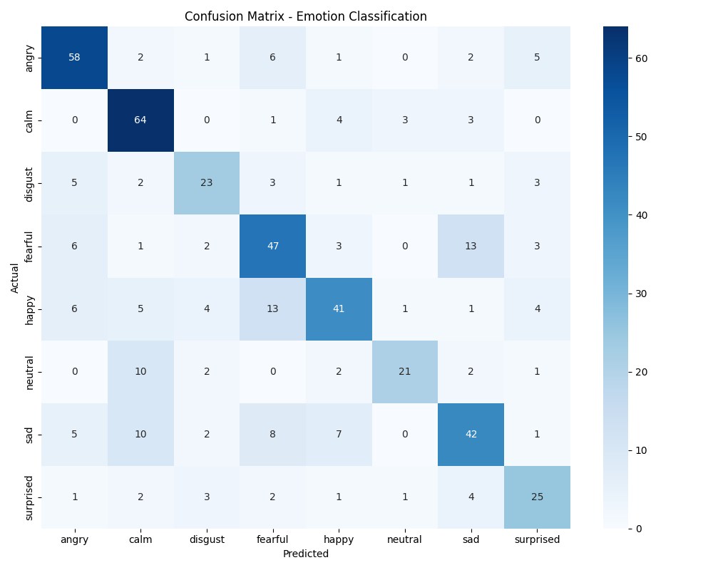

# speech-emotion-recognition
<!-- Initial setup and GitHub project creation -->

This project classifies emotions (like happy, sad, angry, etc.) from .wav speech files using machine learning. It uses MFCC, delta, and spectral features extracted from audio and trains a Random Forest Classifier to predict emotion.
Dataset Used
🎧 RAVDESS Dataset

Used:

Audio_Speech_Actors_01-24

Audio_Song_Actors_01-24

🧠 Features Extracted
From each .wav file:

MFCCs (40)

Delta MFCCs (40)

Spectral features:

Spectral Centroid

Spectral Bandwidth

Spectral Rolloff

Zero Crossing Rate

➕ 1 label per sample

Total = 85 features per sample

⚙️ Model Details
Trained: Random Forest Classifier

Split: 80% training, 20% testing

Accuracy: (insert your model's accuracy here, e.g. 78%)

📈 Evaluation
✅ Confusion Matrix

✅ Classification Report
Saved in: models/classification_report.txt
